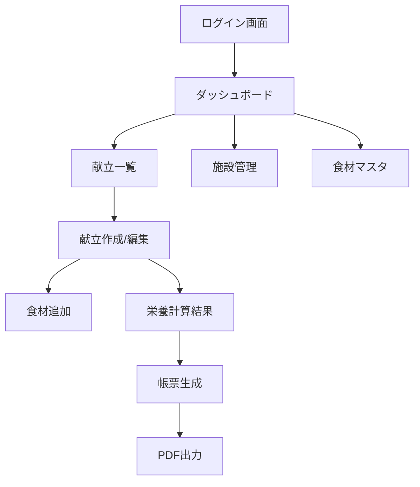
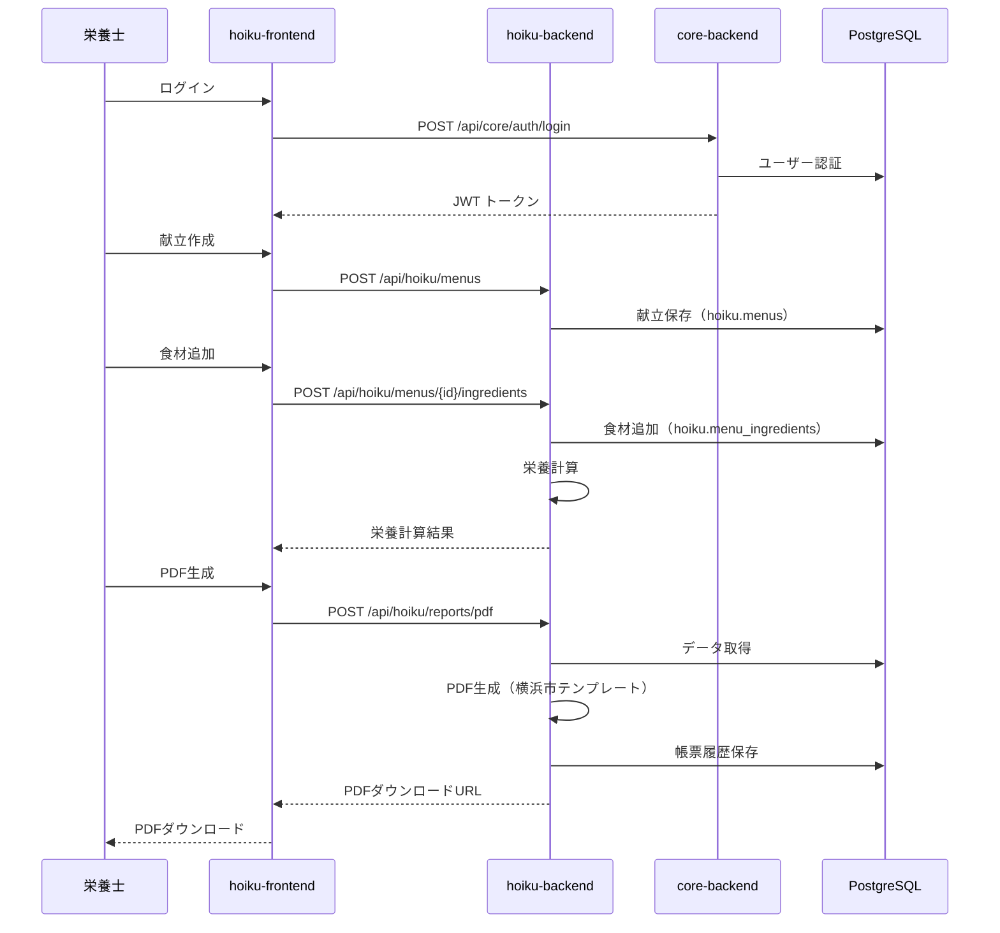

# 機能要件定義書

## ドキュメント情報

| 項目 | 内容 |
|------|------|
| ドキュメント名 | 機能要件定義書 |
| バージョン | 1.0.0 |
| 最終更新日 | 2026-03-08 |
| ステータス | テンプレート |

## 1. MVPスコープ

### 1.1. 実装する機能

以下の機能をMVPとして実装する：

- ✅ 献立入力
- ✅ 栄養計算
- ✅ 横浜市帳票PDF出力
- ✅ 最低限の施設管理
- ✅ ユーザー認証・認可

### 1.2. 実装しない機能（MVP後）

以下の機能はMVP後に実装する：

- ❌ GUI帳票ビルダー
- ❌ AI自動帳票生成
- ❌ 全自治体対応
- ❌ 介護・病院対応
- ❌ 高度な分析機能

## 2. ユーザーストーリー

### 2.1. 認証・アカウント管理

#### US-001: ユーザーログイン

```
As a 栄養士
I want to メールアドレスとパスワードでログインしたい
So that 自分の施設の献立データにアクセスできる
```

**受け入れ基準**:
- [ ] メールアドレスとパスワードでログインできる
- [ ] ログイン成功時にJWTトークンが発行される
- [ ] トークンは24時間有効である
- [ ] ログイン失敗時は適切なエラーメッセージが表示される

#### US-002: パスワードリセット

```
As a ユーザー
I want to パスワードを忘れた場合にリセットしたい
So that 再度ログインできる
```

**受け入れ基準**:
- [ ] メールアドレスを入力してリセットリンクをリクエストできる
- [ ] リセットリンクがメールで送信される
- [ ] リセットリンクは1時間有効である
- [ ] 新しいパスワードを設定できる

### 2.2. 施設管理

#### US-010: 施設情報登録

```
As a 施設管理者
I want to 施設情報を登録したい
So that 施設ごとに献立を管理できる
```

**受け入れ基準**:
- [ ] 施設名、住所、電話番号、定員を登録できる
- [ ] 施設タイプ（保育園）を設定できる
- [ ] 登録した施設情報を編集できる
- [ ] 施設情報を削除できる（論理削除）

### 2.3. 献立管理

#### US-020: 献立作成

```
As a 栄養士
I want to 日付と食事区分を指定して献立を作成したい
So that 毎日の献立を管理できる
```

**受け入れ基準**:
- [ ] 献立日、食事区分（朝食/昼食/おやつ/夕食）を指定できる
- [ ] 献立名、説明を入力できる
- [ ] 対象年齢グループを設定できる
- [ ] 下書き保存ができる
- [ ] 公開（確定）ができる

#### US-021: 食材追加

```
As a 栄養士
I want to 献立に食材と使用量を追加したい
So that 栄養計算ができる
```

**受け入れ基準**:
- [ ] 食材マスタから食材を選択できる
- [ ] 使用量と単位を入力できる
- [ ] 複数の食材を追加できる
- [ ] 追加した食材を編集・削除できる

#### US-022: 献立複製

```
As a 栄養士
I want to 過去の献立を複製したい
So that 似た献立を効率的に作成できる
```

**受け入れ基準**:
- [ ] 過去の献立一覧から選択できる
- [ ] 複製時に日付を変更できる
- [ ] 食材と使用量も複製される
- [ ] 複製後に編集できる

### 2.4. 栄養計算

#### US-030: 自動栄養計算

```
As a 栄養士
I want to 献立の栄養価を自動計算したい
So that 栄養基準を満たしているか確認できる
```

**受け入れ基準**:
- [ ] 献立に追加した食材から自動的に栄養価が計算される
- [ ] エネルギー、たんぱく質、脂質、炭水化物などが表示される
- [ ] ビタミン、ミネラルも表示される
- [ ] 計算結果はリアルタイムに更新される

#### US-031: 栄養基準との比較

```
As a 栄養士
I want to 計算した栄養価を基準値と比較したい
So that 基準を満たしているか判断できる
```

**受け入れ基準**:
- [ ] 自治体・年齢別の栄養基準が表示される
- [ ] 計算値と基準値が並べて表示される
- [ ] 基準を満たしていない項目がハイライトされる
- [ ] 達成率（%）が表示される

### 2.5. 帳票出力

#### US-040: 横浜市帳票PDF出力

```
As a 栄養士
I want to 横浜市指定の帳票フォーマットでPDF出力したい
So that 監査に提出できる
```

**受け入れ基準**:
- [ ] 横浜市の帳票テンプレートが選択できる
- [ ] 期間（開始日-終了日）を指定できる
- [ ] PDF形式でダウンロードできる
- [ ] PDFには施設情報、献立、栄養計算結果が含まれる
- [ ] 帳票は横浜市の指定フォーマットに準拠している

#### US-041: 帳票履歴管理

```
As a 栄養士
I want to 過去に生成した帳票を確認したい
So that 再度ダウンロードや確認ができる
```

**受け入れ基準**:
- [ ] 生成した帳票の一覧が表示される
- [ ] 生成日、帳票タイプ、期間で絞り込みできる
- [ ] 過去の帳票を再ダウンロードできる
- [ ] 帳票のステータス（生成済み/ダウンロード済み）が表示される

### 2.6. 食材マスタ管理

#### US-050: 食材検索

```
As a 栄養士
I want to 食材マスタから食材を検索したい
So that 献立に追加する食材を見つけられる
```

**受け入れ基準**:
- [ ] 食材名で部分一致検索ができる
- [ ] カテゴリー（野菜/肉/魚など）で絞り込みできる
- [ ] 検索結果一覧に食材名、カテゴリー、栄養価が表示される
- [ ] 検索結果から献立に追加できる

#### US-051: 食材追加（管理者）

```
As a 施設管理者
I want to 食材マスタに新しい食材を追加したい
So that 献立で使用できる
```

**受け入れ基準**:
- [ ] 食材名、カテゴリー、単位を入力できる
- [ ] 栄養成分（100gあたり）を入力できる
- [ ] 追加した食材が食材マスタに表示される
- [ ] 追加した食材を編集・削除（無効化）できる

## 3. 機能一覧

### 3.1. Core Backend機能

| 機能ID | 機能名 | 説明 | 優先度 |
|--------|--------|------|--------|
| CORE-001 | ユーザー認証 | JWT認証によるログイン・ログアウト | 高 |
| CORE-002 | ユーザー管理 | ユーザーの登録・編集・削除 | 高 |
| CORE-003 | 施設管理 | 施設情報の登録・編集・削除 | 高 |
| CORE-004 | 役割管理 | ユーザーの役割（管理者/スタッフ）設定 | 中 |
| CORE-005 | テナント管理 | マルチテナントの管理 | 高 |

### 3.2. Hoiku Backend機能

| 機能ID | 機能名 | 説明 | 優先度 |
|--------|--------|------|--------|
| HOIKU-001 | 献立CRUD | 献立の作成・参照・更新・削除 | 高 |
| HOIKU-002 | 献立複製 | 過去の献立を複製 | 中 |
| HOIKU-003 | 食材マスタ管理 | 食材の登録・編集・削除・検索 | 高 |
| HOIKU-004 | 栄養計算エンジン | 献立の栄養価を自動計算 | 高 |
| HOIKU-005 | 栄養基準管理 | 自治体・年齢別の栄養基準管理 | 高 |
| HOIKU-006 | 横浜市帳票PDF出力 | 横浜市指定フォーマットでPDF生成 | 高 |
| HOIKU-007 | 帳票履歴管理 | 生成した帳票の履歴管理 | 中 |

### 3.3. Hoiku Frontend機能

| 機能ID | 機能名 | 説明 | 優先度 |
|--------|--------|------|--------|
| UI-001 | ログイン画面 | メールアドレス・パスワード入力 | 高 |
| UI-002 | ダッシュボード | 施設情報、献立カレンダー表示 | 高 |
| UI-003 | 献立作成画面 | 献立情報入力、食材追加 | 高 |
| UI-004 | 献立一覧画面 | 献立の検索・絞り込み・一覧表示 | 高 |
| UI-005 | 栄養計算結果画面 | 栄養価の表示、基準との比較 | 高 |
| UI-006 | 帳票生成画面 | 帳票タイプ選択、期間指定、PDF生成 | 高 |
| UI-007 | 食材マスタ画面 | 食材の検索・追加・編集 | 中 |

## 4. 画面遷移図



## 5. データフロー

### 5.1. 献立作成から帳票出力まで



## 6. 制約事項

### 6.1. 技術的制約

- ブラウザ: Chrome, Safari, Edge（最新2バージョン）
- PDF生成: サーバーサイドで実施（クライアント側では生成しない）
- ファイルサイズ: PDF1ファイルあたり10MB以下

### 6.2. ビジネス的制約

- MVP: 横浜市帳票のみ対応
- 対象施設: 保育園のみ（介護・病院は対象外）
- 言語: 日本語のみ

## 変更履歴

| 日付 | バージョン | 変更内容 | 担当者 |
|------|-----------|---------|--------|
| 2026-03-08 | 1.0.0 | 初版作成（テンプレート） | - |

---

**注**: このドキュメントはテンプレートです。実際の機能要件に基づいて内容を更新してください。
