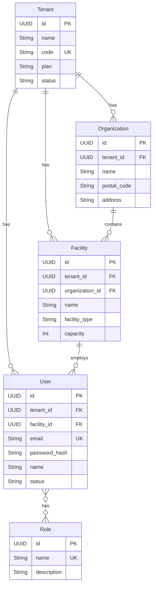
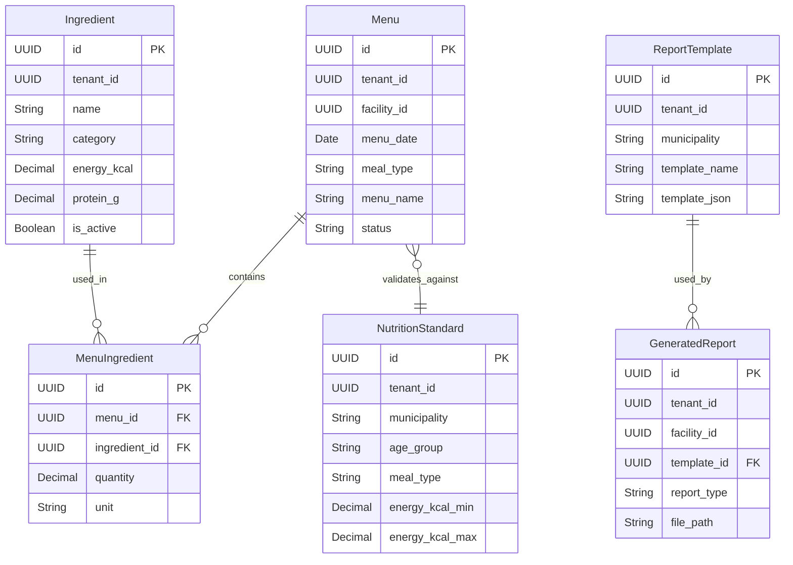

# ドメインモデル設計書

## ドキュメント情報

| 項目 | 内容 |
|------|------|
| ドキュメント名 | ドメインモデル設計書 |
| バージョン | 1.0.0 |
| 最終更新日 | 2026-03-08 |
| ステータス | テンプレート |

## 1. ドメインモデル概要

まもり保育ごはんのドメインは、**Core（共通）** と **Hoiku（保育特化）** の2つに分離されます。

### 1.1. Core Domain（共通ドメイン）

マルチテナント、認証、施設管理など、全サービス共通の機能を提供します。

### 1.2. Hoiku Domain（保育特化ドメイン）

献立、栄養計算、帳票生成など、保育施設特化の機能を提供します。

## 2. Core Domain

### 2.1. エンティティ一覧

| エンティティ名 | 説明 | 主キー |
|--------------|------|--------|
| Tenant | テナント（法人・組織） | UUID |
| Organization | 法人 | UUID |
| Facility | 施設 | UUID |
| User | ユーザー | UUID |
| Role | 役割 | UUID |
| UserRole | ユーザー役割（関連） | UUID |

### 2.2. エンティティ詳細

#### Tenant（テナント）

```kotlin
data class Tenant(
    val id: UUID,
    val name: String,              // テナント名
    val code: String,              // テナントコード（一意）
    val plan: Plan,                // プラン（FREE, BASIC, PREMIUM）
    val status: TenantStatus,      // ステータス（ACTIVE, SUSPENDED, DELETED）
    val createdAt: LocalDateTime,
    val updatedAt: LocalDateTime,
    val createdBy: UUID?,
    val updatedBy: UUID?
)

enum class Plan {
    FREE, BASIC, PREMIUM
}

enum class TenantStatus {
    ACTIVE, SUSPENDED, DELETED
}
```

#### Organization（法人）

```kotlin
data class Organization(
    val id: UUID,
    val tenantId: UUID,            // テナントID（外部キー）
    val name: String,              // 法人名
    val postalCode: String?,       // 郵便番号
    val address: String?,          // 住所
    val phone: String?,            // 電話番号
    val email: String?,            // メールアドレス
    val createdAt: LocalDateTime,
    val updatedAt: LocalDateTime,
    val createdBy: UUID?,
    val updatedBy: UUID?
)
```

#### Facility（施設）

```kotlin
data class Facility(
    val id: UUID,
    val tenantId: UUID,            // テナントID（外部キー）
    val organizationId: UUID?,     // 法人ID（外部キー、NULL可）
    val name: String,              // 施設名
    val facilityType: FacilityType, // 施設タイプ
    val postalCode: String?,       // 郵便番号
    val address: String?,          // 住所
    val phone: String?,            // 電話番号
    val email: String?,            // メールアドレス
    val capacity: Int?,            // 定員
    val createdAt: LocalDateTime,
    val updatedAt: LocalDateTime,
    val createdBy: UUID?,
    val updatedBy: UUID?
)

enum class FacilityType {
    NURSERY,       // 保育園
    ELDERLY_CARE,  // 介護施設
    HOSPITAL,      // 病院
    SCHOOL,        // 学校
    CAFETERIA      // 社員食堂
}
```

#### User（ユーザー）

```kotlin
data class User(
    val id: UUID,
    val tenantId: UUID,            // テナントID（外部キー）
    val facilityId: UUID?,         // 施設ID（外部キー、NULL可）
    val email: String,             // メールアドレス（一意）
    val passwordHash: String,      // パスワードハッシュ
    val name: String,              // 氏名
    val phone: String?,            // 電話番号
    val status: UserStatus,        // ステータス
    val lastLoginAt: LocalDateTime?, // 最終ログイン日時
    val createdAt: LocalDateTime,
    val updatedAt: LocalDateTime,
    val createdBy: UUID?,
    val updatedBy: UUID?
)

enum class UserStatus {
    ACTIVE, INACTIVE, DELETED
}
```

#### Role（役割）

```kotlin
data class Role(
    val id: UUID,
    val name: String,              // 役割名（SYSTEM_ADMIN, TENANT_ADMIN, FACILITY_ADMIN, STAFF）
    val description: String?,      // 説明
    val createdAt: LocalDateTime,
    val updatedAt: LocalDateTime
)
```

### 2.3. ER図（Core Schema）



## 3. Hoiku Domain

### 3.1. エンティティ一覧

| エンティティ名 | 説明 | 主キー |
|--------------|------|--------|
| Menu | 献立 | UUID |
| Ingredient | 食材 | UUID |
| MenuIngredient | 献立食材（関連） | UUID |
| NutritionStandard | 栄養基準 | UUID |
| ReportTemplate | 帳票テンプレート | UUID |
| GeneratedReport | 生成済み帳票 | UUID |

### 3.2. エンティティ詳細

#### Menu（献立）

```kotlin
data class Menu(
    val id: UUID,
    val tenantId: UUID,            // テナントID
    val facilityId: UUID,          // 施設ID
    val menuDate: LocalDate,       // 献立日
    val mealType: MealType,        // 食事区分
    val menuName: String,          // 献立名
    val description: String?,      // 説明
    val targetAgeGroup: String?,   // 対象年齢グループ
    val status: MenuStatus,        // ステータス
    val createdAt: LocalDateTime,
    val updatedAt: LocalDateTime,
    val createdBy: UUID?,
    val updatedBy: UUID?
)

enum class MealType {
    BREAKFAST, LUNCH, SNACK, DINNER
}

enum class MenuStatus {
    DRAFT, PUBLISHED, ARCHIVED
}
```

#### Ingredient（食材）

```kotlin
data class Ingredient(
    val id: UUID,
    val tenantId: UUID,            // テナントID
    val name: String,              // 食材名
    val category: String?,         // カテゴリー（野菜、肉、魚など）
    val unit: String,              // 単位（g, ml, 個など）
    // 栄養成分（100gあたり）
    val energyKcal: BigDecimal?,
    val proteinG: BigDecimal?,
    val fatG: BigDecimal?,
    val carbohydrateG: BigDecimal?,
    val sodiumMg: BigDecimal?,
    val calciumMg: BigDecimal?,
    val ironMg: BigDecimal?,
    val vitaminAUg: BigDecimal?,
    val vitaminB1Mg: BigDecimal?,
    val vitaminB2Mg: BigDecimal?,
    val vitaminCMg: BigDecimal?,
    val dietaryFiberG: BigDecimal?,
    val isActive: Boolean,         // 有効フラグ
    val createdAt: LocalDateTime,
    val updatedAt: LocalDateTime,
    val createdBy: UUID?,
    val updatedBy: UUID?
)
```

#### MenuIngredient（献立食材）

```kotlin
data class MenuIngredient(
    val id: UUID,
    val menuId: UUID,              // 献立ID（外部キー）
    val ingredientId: UUID,        // 食材ID（外部キー）
    val quantity: BigDecimal,      // 使用量
    val unit: String,              // 単位
    val createdAt: LocalDateTime,
    val updatedAt: LocalDateTime
)
```

#### NutritionStandard（栄養基準）

```kotlin
data class NutritionStandard(
    val id: UUID,
    val tenantId: UUID,            // テナントID
    val municipality: String,      // 自治体名（横浜市、川崎市など）
    val ageGroup: String,          // 年齢グループ（0-1歳、1-2歳、3-5歳など）
    val mealType: MealType,        // 食事区分
    val energyKcalMin: BigDecimal?,
    val energyKcalMax: BigDecimal?,
    val proteinGMin: BigDecimal?,
    val proteinGMax: BigDecimal?,
    val fatGMin: BigDecimal?,
    val fatGMax: BigDecimal?,
    val carbohydrateGMin: BigDecimal?,
    val carbohydrateGMax: BigDecimal?,
    val sodiumMgMax: BigDecimal?,
    val calciumMgMin: BigDecimal?,
    val ironMgMin: BigDecimal?,
    val isActive: Boolean,         // 有効フラグ
    val createdAt: LocalDateTime,
    val updatedAt: LocalDateTime,
    val createdBy: UUID?,
    val updatedBy: UUID?
)
```

#### ReportTemplate（帳票テンプレート）

```kotlin
data class ReportTemplate(
    val id: UUID,
    val tenantId: UUID,            // テナントID
    val municipality: String,      // 自治体名
    val templateName: String,      // テンプレート名
    val templateType: String,      // テンプレートタイプ（nutrition_report, menu_listなど）
    val templateJson: String,      // テンプレート定義（JSON）
    val isActive: Boolean,         // 有効フラグ
    val createdAt: LocalDateTime,
    val updatedAt: LocalDateTime,
    val createdBy: UUID?,
    val updatedBy: UUID?
)
```

#### GeneratedReport（生成済み帳票）

```kotlin
data class GeneratedReport(
    val id: UUID,
    val tenantId: UUID,            // テナントID
    val facilityId: UUID,          // 施設ID
    val templateId: UUID?,         // テンプレートID（外部キー、NULL可）
    val reportType: String,        // 帳票タイプ
    val reportDate: LocalDate,     // 帳票日付
    val filePath: String,          // ファイルパス（S3）
    val status: ReportStatus,      // ステータス
    val createdAt: LocalDateTime,
    val updatedAt: LocalDateTime,
    val createdBy: UUID?,
    val updatedBy: UUID?
)

enum class ReportStatus {
    GENERATED, DOWNLOADED, ARCHIVED
}
```

### 3.3. ER図（Hoiku Schema）



## 4. ドメインロジック

### 4.1. 栄養計算エンジン

```kotlin
class NutritionCalculationService {

    fun calculateNutrition(menu: Menu, menuIngredients: List<MenuIngredient>): NutritionResult {
        // 1. 各食材の栄養価を取得
        // 2. 使用量に応じて計算
        // 3. 合計を算出
        return NutritionResult(
            energyKcal = totalEnergy,
            proteinG = totalProtein,
            fatG = totalFat,
            // ... その他の栄養素
        )
    }

    fun validateAgainstStandard(
        nutritionResult: NutritionResult,
        standard: NutritionStandard
    ): ValidationResult {
        // 栄養基準との比較
        val violations = mutableListOf<String>()

        if (nutritionResult.energyKcal < standard.energyKcalMin) {
            violations.add("エネルギーが基準値を下回っています")
        }
        // ... その他の検証

        return ValidationResult(
            isValid = violations.isEmpty(),
            violations = violations
        )
    }
}
```

### 4.2. PDF生成ロジック

```kotlin
class ReportGenerationService(
    private val pdfGenerator: PDFGenerator,
    private val s3Client: S3Client
) {

    fun generateReport(
        facility: Facility,
        menus: List<Menu>,
        template: ReportTemplate
    ): GeneratedReport {
        // 1. テンプレートに基づいてPDF生成
        val pdf = pdfGenerator.generate(template, menus)

        // 2. S3にアップロード
        val filePath = s3Client.upload(pdf, "reports/${facility.id}/${UUID.randomUUID()}.pdf")

        // 3. 帳票履歴を保存
        return GeneratedReport(
            id = UUID.randomUUID(),
            tenantId = facility.tenantId,
            facilityId = facility.id,
            templateId = template.id,
            reportType = template.templateType,
            reportDate = LocalDate.now(),
            filePath = filePath,
            status = ReportStatus.GENERATED,
            createdAt = LocalDateTime.now(),
            updatedAt = LocalDateTime.now(),
            createdBy = null,
            updatedBy = null
        )
    }
}
```

## 5. 集約とバウンダリ

### 5.1. 献立集約（Menu Aggregate）

**集約ルート**: Menu

**含まれるエンティティ**:
- Menu
- MenuIngredient

**不変条件**:
- 献立には最低1つの食材が必要
- 同じ食材を重複して追加できない
- 公開済み（PUBLISHED）の献立は削除できない（アーカイブのみ）

### 5.2. 施設集約（Facility Aggregate）

**集約ルート**: Facility

**含まれるエンティティ**:
- Facility
- User（施設に所属するユーザー）

**不変条件**:
- 施設には最低1人の管理者が必要
- 削除時は全ユーザーを別施設に移動または削除

## 6. バリューオブジェクト

### 6.1. Email

```kotlin
@Embeddable
data class Email(
    val value: String
) {
    init {
        require(value.matches(EMAIL_REGEX)) {
            "Invalid email format: $value"
        }
    }

    companion object {
        private val EMAIL_REGEX = "^[A-Za-z0-9+_.-]+@[A-Za-z0-9.-]+$".toRegex()
    }
}
```

### 6.2. PostalCode

```kotlin
@Embeddable
data class PostalCode(
    val value: String
) {
    init {
        require(value.matches(POSTAL_CODE_REGEX)) {
            "Invalid postal code format: $value"
        }
    }

    companion object {
        private val POSTAL_CODE_REGEX = "^\\d{3}-\\d{4}$".toRegex()
    }
}
```

## 変更履歴

| 日付 | バージョン | 変更内容 | 担当者 |
|------|-----------|---------|--------|
| 2026-03-08 | 1.0.0 | 初版作成（テンプレート） | - |

---

**注**: このドキュメントはテンプレートです。実際のドメインモデルに基づいて内容を更新してください。
