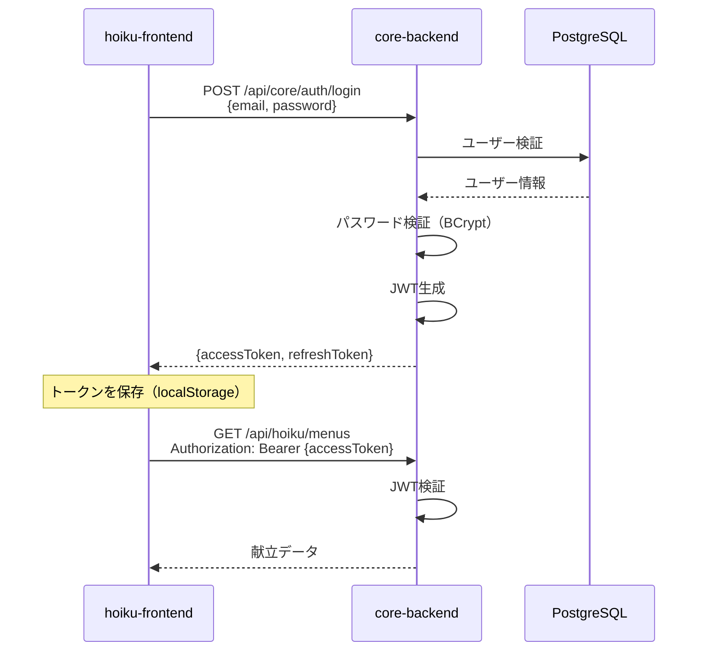
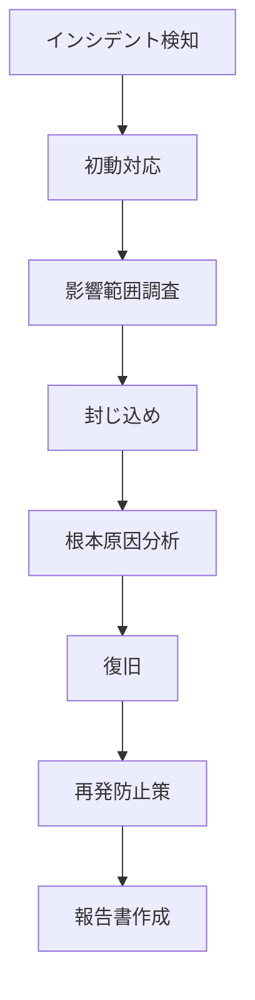

# セキュリティ設計書

## ドキュメント情報

| 項目 | 内容 |
|------|------|
| ドキュメント名 | セキュリティ設計書 |
| バージョン | 1.0.0 |
| 最終更新日 | 2026-03-08 |
| ステータス | テンプレート |

## 1. セキュリティ概要

### 1.1. セキュリティ目標

| 目標 | 説明 |
|------|------|
| 機密性（Confidentiality） | 個人情報・施設情報の保護 |
| 完全性（Integrity） | データの改ざん防止 |
| 可用性（Availability） | サービスの継続提供 |
| 認証（Authentication） | 正当なユーザーの識別 |
| 認可（Authorization） | 適切なアクセス制御 |
| 監査（Auditability） | 操作履歴の記録 |

### 1.2. 脅威モデル

| 脅威 | 影響 | 対策 |
|------|------|------|
| 不正アクセス | データ漏洩 | JWT認証、多層防御 |
| SQLインジェクション | DB改ざん | プリペアドステートメント |
| XSS攻撃 | セッション乗っ取り | 入力値エスケープ、CSP |
| CSRF攻撃 | 不正操作 | トークン検証 |
| DDoS攻撃 | サービス停止 | CloudFront WAF、レート制限 |
| 内部不正 | データ持ち出し | 監査ログ、アクセス制御 |

## 2. 認証（Authentication）

### 2.1. JWT（JSON Web Token）認証

#### フロー



#### JWT構成

**Access Token（有効期限: 24時間）**:
```json
{
  "sub": "user-uuid",
  "email": "user@example.com",
  "tenantId": "tenant-uuid",
  "facilityId": "facility-uuid",
  "roles": ["FACILITY_ADMIN"],
  "iat": 1234567890,
  "exp": 1234654290
}
```

**Refresh Token（有効期限: 7日間）**:
```json
{
  "sub": "user-uuid",
  "type": "refresh",
  "iat": 1234567890,
  "exp": 1235172690
}
```

#### トークン管理

| 項目 | 内容 |
|------|------|
| 保存場所 | localStorage（フロントエンド） |
| HTTPヘッダー | `Authorization: Bearer {token}` |
| トークンリフレッシュ | Access Token期限切れ時にRefresh Tokenで再取得 |
| トークン失効 | ログアウト時にブラックリスト（Redis）に追加（将来） |

### 2.2. パスワードポリシー

| 項目 | 要件 |
|------|------|
| 最小文字数 | 8文字以上 |
| 文字種 | 英大文字、英小文字、数字、記号のうち3種類以上 |
| パスワード履歴 | 過去3回分は使用不可（将来） |
| パスワード有効期限 | 90日（将来） |
| ハッシュアルゴリズム | BCrypt（ストレッチング10回以上） |

### 2.3. ログイン試行制限

| 項目 | 内容 |
|------|------|
| 失敗回数 | 5回以上で15分間ロック |
| ロック解除 | 時間経過またはパスワードリセット |
| アカウント永久ロック | 10回連続失敗で管理者による解除が必要 |

## 3. 認可（Authorization）

### 3.1. ロールベースアクセス制御（RBAC）

#### ロール定義

| ロール | 説明 | 権限 |
|--------|------|------|
| SYSTEM_ADMIN | システム管理者 | 全ての操作が可能 |
| TENANT_ADMIN | テナント管理者 | テナント内の全ての操作が可能 |
| FACILITY_ADMIN | 施設管理者 | 所属施設内の全ての操作が可能 |
| STAFF | 一般スタッフ | 献立の作成・編集、帳票生成のみ |

#### 権限マトリクス

| 機能 | SYSTEM_ADMIN | TENANT_ADMIN | FACILITY_ADMIN | STAFF |
|------|-------------|-------------|---------------|-------|
| ユーザー管理 | ✅ | ✅ | ✅（施設内） | ❌ |
| 施設管理 | ✅ | ✅ | ❌ | ❌ |
| 献立作成・編集 | ✅ | ✅ | ✅ | ✅ |
| 献立削除 | ✅ | ✅ | ✅ | ❌ |
| 帳票生成 | ✅ | ✅ | ✅ | ✅ |
| 食材マスタ編集 | ✅ | ✅ | ✅ | ❌ |

### 3.2. テナント分離

#### Row Level Security（RLS）概念

全てのクエリに `tenant_id` フィルタを自動適用：

```sql
-- 例: 献立一覧取得
SELECT * FROM hoiku.menus
WHERE tenant_id = :currentTenantId
AND facility_id = :currentFacilityId;
```

#### Spring Securityでの実装

```kotlin
@PreAuthorize("hasRole('FACILITY_ADMIN')")
@GetMapping("/menus")
fun getMenus(@CurrentUser user: User): List<MenuResponse> {
    // ユーザーのtenantIdとfacilityIdで自動的にフィルタリング
    return menuService.findByTenantAndFacility(user.tenantId, user.facilityId)
}
```

## 4. データ保護

### 4.1. 暗号化

#### 保存時の暗号化（Encryption at Rest）

| データ | 暗号化方式 |
|--------|-----------|
| パスワード | BCrypt（ハッシュ化） |
| RDS | AWS RDS暗号化（AES-256） |
| S3（PDF帳票） | SSE-S3またはSSE-KMS（AES-256） |
| バックアップ | 暗号化有効 |

#### 通信時の暗号化（Encryption in Transit）

| 通信経路 | 暗号化方式 |
|---------|-----------|
| ブラウザ ↔ CloudFront | TLS 1.2以上 |
| CloudFront ↔ ALB | TLS 1.2以上 |
| ALB ↔ ECS | HTTP（Private Subnet内） |
| ECS ↔ RDS | TLS 1.2以上（SSL接続） |

### 4.2. 個人情報の取り扱い

#### 収集する個人情報

| 項目 | 用途 | 保存場所 |
|------|------|---------|
| メールアドレス | ログイン認証 | core.users |
| 氏名 | ユーザー識別 | core.users |
| 電話番号 | 連絡先 | core.users, core.facilities |
| 住所 | 施設情報 | core.facilities |

#### 個人情報保護対策

- 最小限の情報のみ収集
- 利用目的の明示
- 第三者提供なし
- 保持期限: 退会後1年で削除

### 4.3. ログの安全な管理

#### ログ出力時の注意事項

```kotlin
// ❌ NG: パスワードをログに出力
logger.info("Login attempt: email=${email}, password=${password}")

// ✅ OK: パスワードは出力しない
logger.info("Login attempt: email=${email}")
```

#### マスキング対象

- パスワード
- トークン（JWTの一部のみ表示）
- クレジットカード番号（将来対応時）

## 5. 通信セキュリティ

### 5.1. HTTPS必須化

- 全ての通信をHTTPS化
- HTTP → HTTPSリダイレクト
- HSTS（HTTP Strict Transport Security）有効化

### 5.2. CORS設定

```kotlin
@Configuration
class CorsConfig : WebMvcConfigurer {

    override fun addCorsMappings(registry: CorsRegistry) {
        registry.addMapping("/api/**")
            .allowedOrigins(
                "https://hoiku.mamori.jp",    // 本番
                "http://localhost:3000"       // 開発
            )
            .allowedMethods("GET", "POST", "PUT", "DELETE")
            .allowedHeaders("*")
            .allowCredentials(true)
            .maxAge(3600)
    }
}
```

### 5.3. セキュリティヘッダー

| ヘッダー | 設定値 | 目的 |
|---------|--------|------|
| Content-Security-Policy | default-src 'self' | XSS対策 |
| X-Content-Type-Options | nosniff | MIMEタイプスニッフィング防止 |
| X-Frame-Options | DENY | クリックジャッキング対策 |
| X-XSS-Protection | 1; mode=block | XSS対策（レガシー） |
| Strict-Transport-Security | max-age=31536000 | HTTPS強制 |

## 6. 入力検証

### 6.1. バリデーション

#### Bean Validation

```kotlin
data class MenuRequest(
    @field:NotBlank(message = "献立名は必須です")
    @field:Size(max = 255, message = "献立名は255文字以内です")
    val menuName: String,

    @field:NotNull(message = "献立日は必須です")
    @field:Future(message = "献立日は未来日付である必要があります")
    val menuDate: LocalDate,

    @field:NotNull(message = "食事区分は必須です")
    val mealType: MealType
)
```

#### カスタムバリデーション

```kotlin
@Constraint(validatedBy = [TenantIdValidator::class])
annotation class ValidTenantId

class TenantIdValidator : ConstraintValidator<ValidTenantId, UUID> {
    override fun isValid(value: UUID?, context: ConstraintValidatorContext): Boolean {
        // テナントIDの存在確認
        return value != null && tenantRepository.existsById(value)
    }
}
```

### 6.2. SQLインジェクション対策

#### プリペアドステートメント使用

```kotlin
// ✅ OK: Spring Data JPAのクエリメソッド
interface MenuRepository : JpaRepository<MenuEntity, UUID> {
    fun findByTenantIdAndFacilityId(tenantId: UUID, facilityId: UUID): List<MenuEntity>
}

// ✅ OK: @Queryでパラメータバインディング
@Query("SELECT m FROM MenuEntity m WHERE m.tenantId = :tenantId")
fun findByTenant(@Param("tenantId") tenantId: UUID): List<MenuEntity>

// ❌ NG: 文字列結合（脆弱）
// "SELECT * FROM menus WHERE tenant_id = '$tenantId'"
```

### 6.3. XSS（クロスサイトスクリプティング）対策

#### 出力エスケープ

```tsx
// React: デフォルトでエスケープされる
<div>{menuName}</div>

// dangerouslySetInnerHTMLは使用禁止
// <div dangerouslySetInnerHTML={{__html: userInput}} />
```

## 7. 監査ログ

### 7.1. ログ記録対象

| イベント | ログレベル | 内容 |
|---------|-----------|------|
| ログイン成功 | INFO | ユーザーID、IPアドレス、タイムスタンプ |
| ログイン失敗 | WARN | メールアドレス、IPアドレス、理由 |
| ログアウト | INFO | ユーザーID、タイムスタンプ |
| 献立作成 | INFO | ユーザーID、献立ID、タイムスタンプ |
| 献立削除 | WARN | ユーザーID、献立ID、タイムスタンプ |
| ユーザー作成 | INFO | 作成者ID、新規ユーザーID |
| ユーザー削除 | WARN | 削除者ID、削除ユーザーID |
| 権限変更 | WARN | 変更者ID、対象ユーザーID、変更内容 |

### 7.2. ログフォーマット（JSON）

```json
{
  "timestamp": "2026-03-08T10:30:00Z",
  "level": "INFO",
  "event": "LOGIN_SUCCESS",
  "userId": "user-uuid",
  "tenantId": "tenant-uuid",
  "ipAddress": "192.168.1.100",
  "userAgent": "Mozilla/5.0...",
  "message": "User logged in successfully"
}
```

### 7.3. ログ保存期間

| ログタイプ | 保存期間 | 保存先 |
|----------|---------|--------|
| アプリケーションログ | 90日 | CloudWatch Logs |
| 監査ログ | 3年 | CloudWatch Logs → S3 |
| アクセスログ | 1年 | S3 |

## 8. インシデント対応

### 8.1. セキュリティインシデント対応フロー



### 8.2. エスカレーション

| レベル | 対応時間 | 通知先 |
|--------|---------|--------|
| Critical | 即時 | 開発責任者、経営層 |
| High | 1時間以内 | 開発責任者 |
| Medium | 4時間以内 | 開発チーム |
| Low | 1営業日以内 | 開発チーム |

### 8.3. インシデント例と対応

| インシデント | 対応 |
|------------|------|
| 不正アクセス検知 | アカウントロック、パスワードリセット強制 |
| DDoS攻撃 | WAFルール適用、レート制限強化 |
| データ漏洩 | 該当ユーザーへの通知、個人情報保護委員会への報告 |
| 脆弱性発見 | 緊急パッチ適用、影響調査 |

## 9. セキュリティテスト

### 9.1. テスト項目

| テスト項目 | 頻度 | ツール |
|----------|------|--------|
| 脆弱性スキャン | 毎週 | Dependabot, Snyk |
| ペネトレーションテスト | 年1回 | 外部セキュリティ会社 |
| SQLインジェクションテスト | リリース前 | OWASP ZAP |
| XSSテスト | リリース前 | OWASP ZAP |
| CSRFテスト | リリース前 | 手動テスト |

### 9.2. OWASP Top 10対策状況

| 脅威 | 対策状況 |
|------|---------|
| A01: Broken Access Control | ✅ RBAC、テナント分離 |
| A02: Cryptographic Failures | ✅ TLS、BCrypt、RDS暗号化 |
| A03: Injection | ✅ プリペアドステートメント |
| A04: Insecure Design | ✅ セキュアな設計レビュー |
| A05: Security Misconfiguration | ✅ セキュリティヘッダー設定 |
| A06: Vulnerable Components | ✅ Dependabot監視 |
| A07: Authentication Failures | ✅ JWT、ログイン試行制限 |
| A08: Software and Data Integrity | ✅ コード署名、監査ログ |
| A09: Logging Failures | ✅ CloudWatch Logs |
| A10: SSRF | ✅ 外部APIアクセス制限 |

## 変更履歴

| 日付 | バージョン | 変更内容 | 担当者 |
|------|-----------|---------|--------|
| 2026-03-08 | 1.0.0 | 初版作成（テンプレート） | - |

---

**注**: このドキュメントはテンプレートです。実際のセキュリティ設計に基づいて内容を更新してください。
