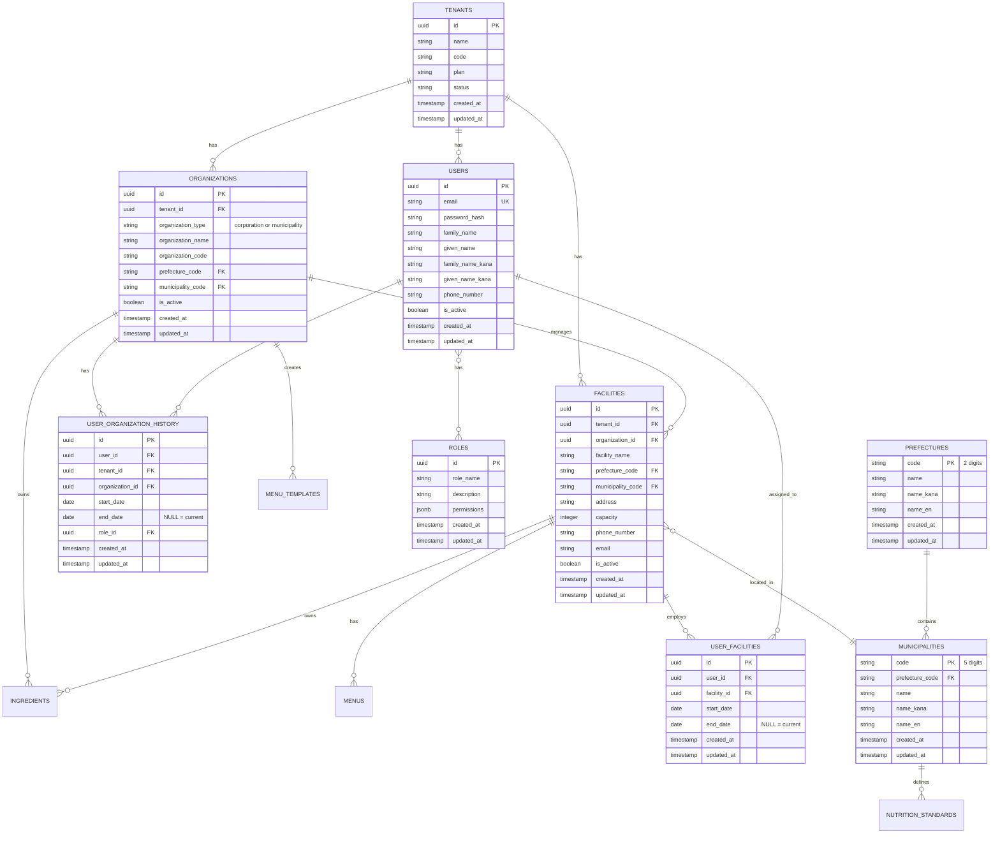
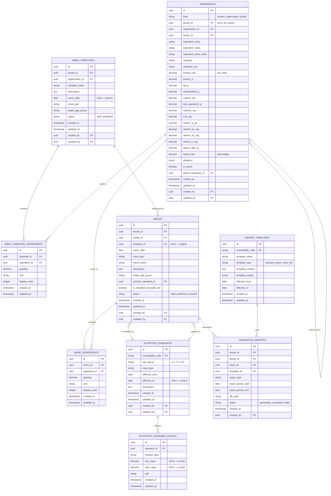

# 完全ER図

全国展開対応版のエンティティ関連図

## 全体構成

### Core Schema（共通機能）



### Hoiku Schema（保育特化）



## 主要なリレーションシップ

### 1. テナント階層

```
Tenant (契約単位)
  └─ Organization (法人・自治体)
      └─ Facility (施設)
          └─ Menu (献立)
```

### 2. ユーザー所属

```
User (個人)
  └─ UserOrganizationHistory (組織所属履歴)
      ├─ start_date: 2024-04-01
      └─ end_date: NULL (現在も所属中)
  └─ UserFacilities (施設担当)
      ├─ Facility A (2024-04-01 ~ 2025-03-31)
      └─ Facility B (2025-04-01 ~ NULL)
```

### 3. 食材マスタの継承

```
System Ingredient (システムマスタ)
  └─ Organization Ingredient (組織カスタマイズ)
      └─ Facility Ingredient (施設独自食材)
```

### 4. 献立配布フロー

```
MenuTemplate (本部作成)
  ├─ Menu (施設A)
  ├─ Menu (施設B)
  └─ Menu (施設C)
```

### 5. 栄養基準の適用

```
Municipality (自治体)
  └─ NutritionStandard (栄養基準)
      └─ NutritionStandardDetail (各栄養素)
          ├─ energy: 450-550 kcal
          ├─ protein: 15-20 g
          └─ ...

Facility (施設)
  └─ municipality_code で自動判定
      └─ Menu に適用
```

## カーディナリティ

| リレーション | カーディナリティ | 説明 |
|------------|----------------|------|
| Tenant - Organization | 1:N | 1テナントが複数組織を持つ（将来対応） |
| Organization - Facility | 1:N | 1組織が複数施設を管理 |
| Facility - Menu | 1:N | 1施設が複数献立を持つ |
| Menu - MenuIngredient | 1:N | 1献立が複数食材を含む |
| User - UserOrganizationHistory | 1:N | 履歴管理（入退社・異動） |
| User - UserFacilities | N:N | 1ユーザーが複数施設を担当可能 |
| MenuTemplate - Menu | 1:N | 1テンプレートから複数献立を生成 |
| NutritionStandard - Menu | 1:N | 1基準が複数献立に適用 |

## インデックス戦略

### 必須インデックス

| テーブル | カラム | 理由 |
|---------|--------|------|
| facilities | (tenant_id, organization_id) | 施設一覧取得 |
| facilities | municipality_code | 栄養基準の自動判定 |
| menus | (facility_id, menu_date) | 日付範囲での献立検索 |
| menus | nutrition_standard_id | 基準別の献立検索 |
| ingredients | (level, tenant_id, organization_id, facility_id) | 階層別の食材検索 |
| ingredients | ingredient_name | 食材名での検索 |
| user_organization_history | (user_id, end_date) | 現在所属中の組織検索 |
| user_facilities | (user_id, end_date) | 現在担当中の施設検索 |
| nutrition_standards | (municipality_code, age_group, meal_type, effective_from) | 栄養基準の検索 |

### 複合インデックス

```sql
-- 献立検索の最適化
CREATE INDEX idx_menus_facility_date ON hoiku.menus(facility_id, menu_date);
CREATE INDEX idx_menus_tenant_facility ON hoiku.menus(tenant_id, facility_id);

-- 食材マスタの階層検索
CREATE INDEX idx_ingredients_level_org_facility
ON hoiku.ingredients(level, organization_id, facility_id);

-- ユーザー所属の検索
CREATE INDEX idx_user_org_history_active
ON core.user_organization_history(user_id, organization_id)
WHERE end_date IS NULL;

CREATE INDEX idx_user_facilities_active
ON core.user_facilities(user_id, facility_id)
WHERE end_date IS NULL;
```

## 次のステップ

1. ✅ ドメインモデル v2 作成完了
2. ✅ ER図作成完了
3. 次: 各テーブルの詳細DDL作成
4. 次: Flyway マイグレーションファイル作成
