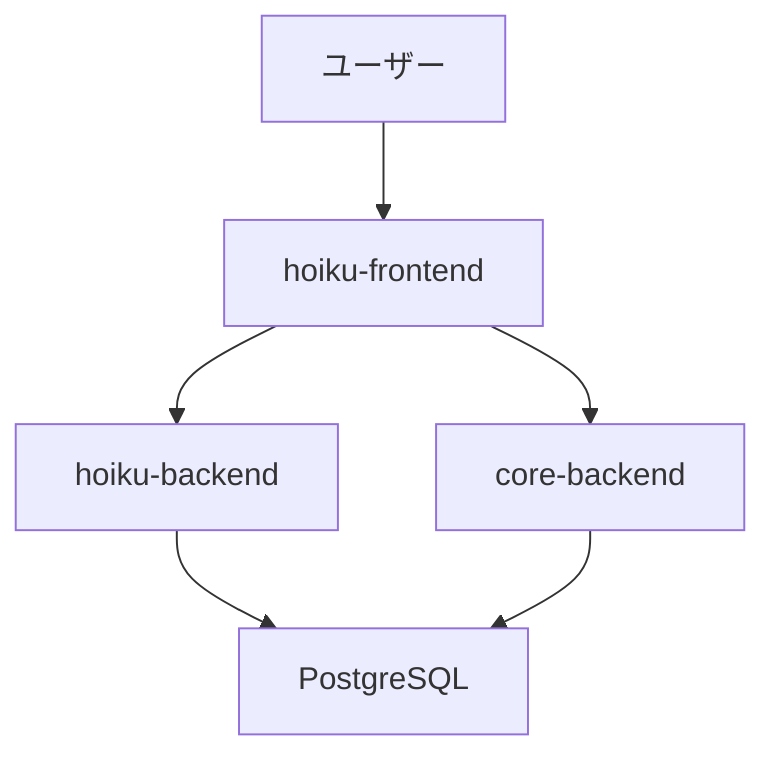

# まもり保育ごはん - ドキュメント管理

## 概要

このディレクトリには、まもり保育ごはんの設計書・仕様書などのドキュメントを管理します。

## ドキュメント管理方針

### 基本原則

1. **全てのドキュメントはGit管理対象**
   - 変更履歴を追跡可能にする
   - プルリクエストでレビュー可能にする
   - 事業売却時にも引き継ぎ可能にする

2. **Markdown形式で記述**
   - バージョン管理に適している
   - GitHub上で読みやすい
   - 図表はMermaid（テキストベース）を活用

3. **ドキュメントの鮮度を保つ**
   - 実装と設計書の乖離を防ぐ
   - 機能追加・変更時は必ずドキュメントも更新
   - レビュー時にドキュメント更新も確認

4. **将来の開発者が理解できる記述**
   - 前提知識を明記
   - 設計判断の理由を記載
   - Why（なぜ）を重視

## ディレクトリ構造

```
docs/
├── README.md                           # このファイル（ドキュメント管理方針）
├── 01_requirements/                    # 要件定義
│   ├── README.md                       # 要件定義の概要
│   ├── business-requirements.md        # ビジネス要件
│   ├── functional-requirements.md      # 機能要件
│   └── non-functional-requirements.md  # 非機能要件
├── 02_design/                          # システム設計
│   ├── README.md                       # 設計の概要
│   ├── system-architecture.md          # システムアーキテクチャ
│   ├── domain-model.md                 # ドメインモデル
│   └── security-design.md              # セキュリティ設計
├── 03_database/                        # データベース設計
│   ├── README.md                       # DB設計の概要
│   ├── schema-design.md                # スキーマ設計（Core/Hoiku分離）
│   ├── table-definitions/              # テーブル定義書
│   │   ├── core/                       # Core Schema
│   │   │   ├── tenants.md
│   │   │   ├── organizations.md
│   │   │   ├── facilities.md
│   │   │   ├── users.md
│   │   │   ├── roles.md
│   │   │   └── user_roles.md
│   │   └── hoiku/                      # Hoiku Schema
│   │       ├── menus.md
│   │       ├── ingredients.md
│   │       ├── menu_ingredients.md
│   │       ├── nutrition_standards.md
│   │       ├── report_templates.md
│   │       └── generated_reports.md
│   └── er-diagrams/                    # ER図
│       ├── core-er.md                  # Core SchemaのER図
│       └── hoiku-er.md                 # Hoiku SchemaのER図
├── 04_api/                             # API設計
│   ├── README.md                       # API設計の概要
│   ├── core-api.md                     # Core Backend API仕様
│   └── hoiku-api.md                    # Hoiku Backend API仕様
├── 05_infrastructure/                  # インフラ設計
│   ├── README.md                       # インフラ設計の概要
│   ├── aws-architecture.md             # AWS構成図
│   ├── network-design.md               # ネットワーク設計
│   └── security-infrastructure.md      # セキュリティインフラ設計
├── 06_testing/                         # テスト仕様
│   ├── README.md                       # テスト戦略の概要
│   ├── test-plan.md                    # テスト計画
│   └── test-cases/                     # テストケース
│       ├── unit-test.md                # 単体テスト
│       ├── integration-test.md         # 統合テスト
│       └── e2e-test.md                 # E2Eテスト
├── 07_operations/                      # 運用設計
│   ├── README.md                       # 運用設計の概要
│   ├── deployment.md                   # デプロイ手順
│   ├── monitoring.md                   # 監視設計
│   └── backup-recovery.md              # バックアップ・リカバリ設計
└── 08_claude/                          # Claude Code設定
    ├── README.md                       # Claude Code設定の概要
    ├── setup-guide.md                  # 初期設定手順
    ├── usage-guide.md                  # 効果的な使い方
    └── rules-guide.md                  # ルールファイル運用方針
```

## ドキュメント作成フロー

### 1. 機能開発時

```
要件定義 → システム設計 → DB設計 → API設計 → 実装 → テスト → デプロイ
   ↓          ↓           ↓        ↓
  docs/    docs/       docs/    docs/
  01_      02_         03_      04_
```

### 2. ドキュメント更新タイミング

- **新機能開発時**: 要件定義から順に作成
- **仕様変更時**: 影響するドキュメントを全て更新
- **バグ修正時**: 設計に影響する場合は設計書も更新
- **リファクタリング時**: アーキテクチャに影響する場合は設計書も更新

### 3. レビュー基準

プルリクエストのレビュー時に以下を確認：

- [ ] 実装内容とドキュメントの整合性
- [ ] ドキュメントの更新漏れがないか
- [ ] 設計判断の理由が記載されているか
- [ ] 将来の開発者が理解できる記述か

## ドキュメントテンプレート

各ドキュメントには以下のセクションを含めることを推奨：

### 基本構成

```markdown
# [ドキュメント名]

## 概要
- このドキュメントの目的
- 対象読者

## 前提条件
- 必要な前提知識
- 関連ドキュメントへのリンク

## [本文セクション]
- 具体的な内容

## 変更履歴
| 日付 | バージョン | 変更内容 | 担当者 |
|------|-----------|---------|--------|
| 2026-03-08 | 1.0.0 | 初版作成 | - |
```

## 図表の作成方針

### Mermaidを活用

ER図、シーケンス図、フローチャートなどはMermaid記法で記述：



### 複雑な図表

- Draw.io（diagrams.net）で作成し、SVGでエクスポート
- `docs/assets/images/` に配置
- Markdownから参照

## Git管理のベストプラクティス

### コミットメッセージ

```
docs: [ドキュメント名] を追加/更新

- 変更内容の概要
- 変更理由
```

例：
```
docs: API設計書を更新

- 献立API のページネーション仕様を追加
- レスポンス形式を統一
```

### ブランチ戦略

- ドキュメント更新も `feature/*` ブランチで実施
- 実装と同じプルリクエストに含める（推奨）
- ドキュメントのみの更新は `docs/*` ブランチでも可

## 除外ファイル

以下のファイルはGit管理対象外とする：

- 一時ファイル（`*.tmp`, `*.bak`）
- ローカルメモ（`*.local.md`, `TODO.md`）
- バイナリファイル（画像はSVG推奨、PNG/JPGは必要最小限）

`.gitignore` に以下を追加済み：

```
# ドキュメント関連の除外ファイル
docs/**/*.tmp
docs/**/*.bak
docs/**/*.local.md
docs/**/TODO.md
```

## メンテナンス方針

### 定期レビュー

- **月次**: ドキュメントと実装の乖離確認
- **四半期**: ドキュメント全体の見直し
- **リリース前**: 全ドキュメントの最終確認

### ドキュメント品質指標

- 実装とドキュメントの整合率: 100%
- ドキュメント更新頻度: 実装と同期
- レビュー指摘率: プルリクエストあたり0件

## 事業売却時の引き継ぎ

このドキュメント群は事業売却時の重要な資産です：

1. **完全なドキュメント**: 要件から運用まで全て網羅
2. **変更履歴の追跡**: Gitで全ての変更が追跡可能
3. **設計判断の記録**: Whyを含めた記述で背景が理解可能
4. **継続的な更新**: 実装と常に同期されている

## 参考資料

- [CLAUDE.md](../CLAUDE.md) - プロジェクト全体の指示書
- [README.md](../README.md) - プロジェクトの概要
- [initial_doc.txt](../initial_doc.txt) - 初期設計の構想

## 問い合わせ

ドキュメントに関する質問や改善提案は、GitHubのIssueまたはプルリクエストで受け付けます。
